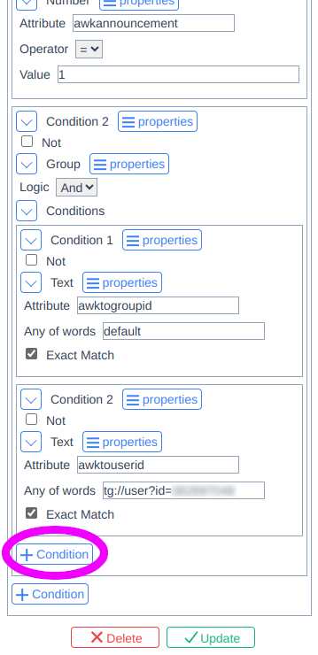

# Disable Permits Exhausted Notification

1. Go to own queries list and find the one named `_Reserved_System` 
2. Click on the query and scroll down 
3. Add the negative (`Not` checked) condition to the end with key `type` equal (exactly) to `com.awakari.api.permits.exhausted`  
